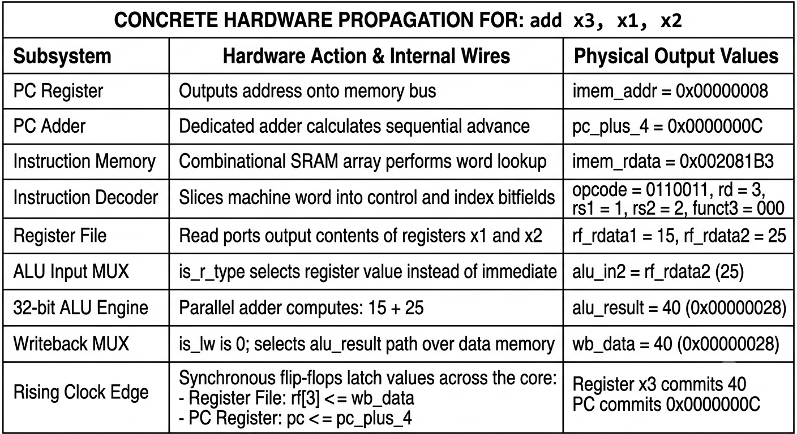

**Mini-Takshaka**: A Simple Guide to the Single-Cycle RISC-V Core
A synthesizable RV32I baseline core — what it is and exactly how it works

---

1. **What is Mini-Takshaka?**

Mini-Takshaka is a working, synthesizable 32-bit RISC-V processor that implements the base integer instruction set (RV32I). I built/studied it as a reference core — a simple, complete starting point for understanding datapath timing, register files, and instruction retirement before moving up to pipelined cores like Takshaka.

**What "single-cycle" means**

Every instruction completes its entire life in exactly one clock tick (CPI = 1.0).

Fetch → decode → execute → write back, all inside one clock period.

The big advantage: zero hazards

Because each instruction fully finishes before the next one starts, hazards can't physically happen:

- No data hazards (RAW): an instruction can never read a register whose new value isn't written yet — nothing else is in flight.
- No load-use stalls: a `lw` writes its value into the register file within the same cycle; the next instruction just reads the updated file.
- No branch bubbles: the branch condition and the target address are both computed in the same cycle, so the PC updates cleanly — no pipeline to flush.

**The big disadvantage**: the critical path

Zero hazards come at a price. The clock period must be long enough for the signal to crawl through every block in series:

```
Critical Path = Tpc + Timem + Tdecode + Tregread + Talu + Tdmem + Tmux + Tsetup
```

The clock is sized for the slowest instruction (`lw`), so the core is stuck around 50 MHz.

And that is the whole reason pipelined cores like Takshaka exist: chop the path into 3 shorter stages, run the clock 3–4× faster, then handle the hazards that appear. Mini-Takshaka is the "before" picture that makes the "after" make sense.

---

2. **The Datapath, as Q&A**

**How is an instruction fetched?**
- Modules: PC register + Instruction Memory (IMEM).
- The PC drives the address lines `imem_addr[31:0]`. IMEM does a combinational read and returns the 32-bit word on `imem_rdata[31:0]`. At the same time, a separate adder computes `pc + 4` for the sequential path.

**How is it decoded?**
- Module: a hardwired combinational decoder.
- The 32-bit word is sliced into its RISC-V fields:
  - `opcode` = bits [6:0] — which class of instruction (R / I / S / B)
  - `rd` = bits [11:7] — destination register number
  - `funct3` = bits [14:12] — the operation sub-type
  - `rs1` = bits [19:15] — source register 1
  - `rs2` = bits [24:20] — source register 2
  - `funct7` = bits [31:25] — mode selector (e.g. ADD vs SUB)
- Immediate generator: sign-extends the embedded constants into full 32-bit values:
  - `imm_i` for `addi`, `lw`
  - `imm_s` for `sw`
  - `imm_b` for `beq`

**How are registers read and written?**
- 32 general-purpose 32-bit registers (x0–x31).
- Reads are combinational: give the rs1/rs2 numbers, the data appears on `rf_rdata1` / `rf_rdata2` within nanoseconds — no clock edge needed.
- x0 is hardwired to zero: reads always give 0, writes are silently dropped.
- One write, on the clock edge: if the decoder asserts `reg_write`, `wb_data` is latched into register `rd` at the rising edge.

**How does the ALU work?**
- Operand A = `rf_rdata1`.
- A mux picks Operand B: `rf_rdata2` for register-register ops (R-type), or the sign-extended immediate for I-type/S-type.
- AGU: for `lw`/`sw`, the ALU doubles as the address calculator:
  `effective address = rs1 + immediate offset`

**How are branches handled?**
- A comparator checks the condition (e.g. `rf_rdata1 == rf_rdata2` for `beq`).
- In parallel, a branch adder computes `branch target = PC + imm_b`.
- If the condition is true, `branch_taken` fires, and the PC mux loads the target on the next clock edge. All in one cycle — no bubbles.

**How does the core talk to data memory?**
- `sw`: ALU result → `dmem_addr`, `rf_rdata2` → `dmem_wdata`, and `dmem_we` asserts, so RAM captures the word on the clock edge.
- `lw`: ALU result → `dmem_addr`, RAM returns the data on `dmem_rdata`.

**How is writeback handled?**
- A mux picks what commits to `rd`, in one line of Verilog:

```verilog
wb_data = (opcode == LW) ? dmem_rdata : alu_result;
```

- Retirement: at the rising clock edge, `wb_data` lands in register `rd` and `pc_next` lands in the PC. The instruction is done.

---

3. Deep Trace: the full life of `add x3, x1, x2`

(Note: the original notes stopped here at the setup with only a diagram — this section completes the trace step by step, so it can be presented live without the image.)

Instruction: `add x3, x1, x2`  →  hardware goal: x3 = x1 + x2
Initial state: x1 = 15 (`0x0000000F`), x2 = 25 (`0x00000019`), PC = `0x00000008`
Machine code at 0x8: `0x002081B3`

Quick sanity check of the encoding:

```
funct7=0000000 | rs2=00010 (x2) | rs1=00001 (x1) | funct3=000 (ADD) | rd=00011 (x3) | opcode=0110011 (R-type)
```

✓ matches `0x002081B3`.

Step 1 — Fetch (what address, what word)
- PC = `0x00000008` goes onto `imem_addr`.
- IMEM returns `0x002081B3` on `imem_rdata`.
- In parallel: `pc + 4 = 0x0000000C` is pre-computed.

Step 2 — Decode (what does it mean)
- Decoder slices the fields: opcode = R-type math, rs1 = x1, rs2 = x2, rd = x3, funct3 = ADD.
- Control lines set: ALU operation = ADD, `reg_write = 1`, `dmem_we = 0`, branch not taken.

Step 3 — Register read (get the ingredients)
- rs1 = 1 → `rf_rdata1` = 15
- rs2 = 2 → `rf_rdata2` = 25

Step 4 — Execute (do the math)
- ALU input mux picks the register path for Operand B (it's R-type).
- Adder computes 15 + 25 = 40 (`0x00000028`).
- `branch_taken` = 0, so the PC mux will select `pc + 4`.

Step 5 — Writeback (commit the result)
- Writeback mux: not a load → selects ALU result 40.
- Rising clock edge:
  - x3 latches 40 (`0x00000028`) ✅
  - PC latches `0x0000000C` — pointing at the next instruction.


Done. One instruction, one clock tick, zero hazards. Follow-up instructions read x3 = 40 directly from the register file in the next cycle — that's the single-cycle.

---

